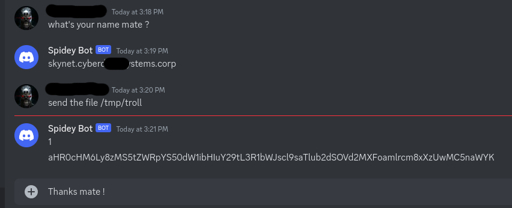

<hr/>

<hr/>

## :warning: Disclaimer :warning:
:warning:️<br>
:warning:Alfred is for educational purpose only!<br>
:warning:️I am not responsible for any damage caused by the usage of this tool.<br>
:warning:
️
# What ?
alfred.py is a data evasion tool using Discord channel webhook to send information.
# How?
* Rename .webhook.sample by .webhook & modify it to add the url of the channel's webhook you'll use.
* You can call the script with 2 options:
  * -f \<FULLPATH/FILENAME2> \<FULLPATH/FILENAME2> ... : will send base64 encoded filename1, filename2, etc.
  * -c \<COMMANDLINE>              : will send stdout of the provided commandline if return code is 0.

if you send file(s), the script first send the number of chrunk then send the encoded file.



## License
```
/*
 * ----------------------------------------------------------------------------
 * "THE BEER-WARE LICENSE" (Revision 42):
 * I wrote this file.  As long as you retain this notice you
 * can do whatever you want with this stuff. If we meet some day, and you think
 * this stuff is worth it, you can buy me a beer in return.   Olivier FONT
 * ----------------------------------------------------------------------------
 */
```
